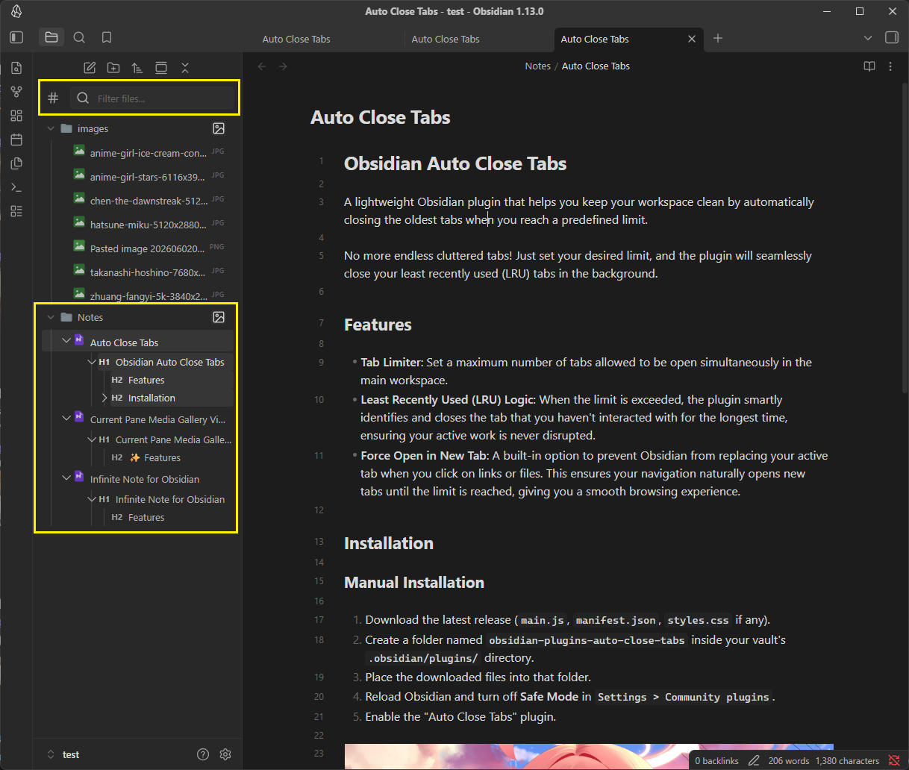
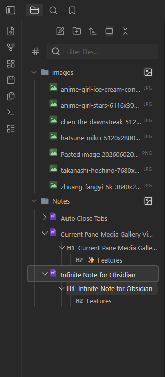

# Obsidian Enhance Navigate Pane

An Obsidian plugin that superpowers your native File Explorer (Navigate Pane) with advanced features like inline heading navigation, powerful multi-term filtering, custom icons, and extensive appearance customization.

## ✨ Features & Usage Guide

### 🔍 Advanced Filtering & Search
A highly responsive search bar injected directly to the top of the native File Explorer, allowing you to instantly find files, folders, and even headings.

- **Multi-term Search:** Type multiple words (e.g., `my project`) to find items containing that exact phrase.
- **OR Operator (`|`):** Use the pipe symbol `|` to search for multiple conditions at once. For example, typing `data | file | image` will show any file, folder, or heading containing `data`, OR `file`, OR `image`.
- **Search All File Types:** The filter searches across all file extensions in your vault (e.g., `.jpg`, `.png`, `.pdf`), not just markdown files.
- **Heading Search:** Search doesn't just find files and folders; it can also match markdown headings inside your `.md` files! You can toggle this on/off using the search options icon next to the textbox.
- **Tree Hierarchy Preservation:** When a nested file or heading matches your search, the plugin displays the complete folder and heading structure above it, ensuring you never lose context.
- **Highlight Matches:** Search results are beautifully highlighted (soft yellow background, black text) for maximum readability, including highlighting specific matched words from an OR query.

### 📑 Headings Navigation
Seamlessly navigate through your document structure directly from the sidebar.

- **Inline Headings:** View your markdown headings (H1-H6) directly underneath the files in the File Explorer. 
- **Jump to Content:** Click any heading to instantly open the file and jump to that exact line in the document.
- **Limit Heading Depth:** Choose the maximum heading level to display (e.g., only show up to H3) to keep your pane clean.
- **Auto-expand:** Automatically expand the heading tree down to a specific level when opening or viewing a file.
- **Smart Arrow Expansion:** Configure what happens when you click a heading's collapse arrow: expand only the "Next level" or expand "All levels" at once.

### 🎨 Appearance & UI Customization
Make your File Explorer look exactly the way you want with real-time updates.

- **Icon Sets:** Add beautiful file and folder icons to your explorer. Choose from **Material Icons**, **VSCode Icons**, **Phosphor Icons**, or **Lucide Icons** (or stick to the default Obsidian look). Changes apply instantly without restarting.
- **Font Size:** Adjust the text size specifically for the File Explorer.
- **Item Padding & Margin:** Tweak the spacing around files and folders for a more compact or spacious look (e.g., `4px 8px`).
- **Tree Indentation:** Precisely control the indentation width for nested files and folders (e.g., `20px` or `1.5em`).
- **Bulletproof Alignment:** The plugin features a hybrid layout system ensuring that expand/collapse arrows and file icons are always perfectly aligned and visible, regardless of how heavily customized your theme is.

### 🖱️ Workflow Enhancements
- **Recursive Collapse:** When enabled, collapsing a folder, file, or heading will automatically collapse all of its nested children. No more messy, fully-expanded trees when you reopen a folder!
- **Intercept Mouse Click:** If you prefer using the keyboard or don't want to accidentally open files, this feature prevents a single click from opening a file. A single click will only select/highlight the file, allowing you to navigate with arrow keys. You must double-click or press `Enter` to actually open the file.

---

## ⚙️ Settings Configuration

| Setting | Description |
| :--- | :--- |
| **Enable Filter Textbox** | Show a textbox at the top of the file explorer to filter files and folders. |
| **Recursive Collapse** | Automatically collapse all nested items when you collapse a parent item. |
| **Intercept Mouse Click** | Require double-click or `Enter` to open files. Single-click only selects. |
| **Icon Set** | Choose between Default, Material, VSCode, Phosphor, or Lucide icons. |
| **Font Size** | Custom font size for the File Explorer (e.g., `14px`). |
| **Item Padding & Margin** | Custom CSS padding/margin for items (e.g., `4px 8px`). |
| **Tree Indentation** | Custom indentation width for nested trees (e.g., `20px`). |
| **Show Headings in Tree** | Enable/disable inline headings display. |
| **Show headings up to** | Limit depth of displayed headings (H1-H6). |
| **Auto-expand down to** | Automatically expand headings up to a certain level on file open. |
| **Arrow expands** | Configure arrow click behavior (`Next level` or `All levels`). |

---

## 🚀 Installation

### Manual Installation
1. Download the latest release from the GitHub releases page.
2. Extract the files (`main.js`, `manifest.json`, `styles.css` if applicable) into your Obsidian vault's plugins folder: `[YourVault]/.obsidian/plugins/obsidian-plugins-enhance-navigate-pane/`
3. Restart Obsidian (or reload plugins) and enable **Enhance Navigate Pane** in `Settings -> Community Plugins`.

---

## 🆕 What's New in Version 1.0.1

- **Bug Fix:** Fixed an issue where changing the `Icon Set` in the settings did not update the file explorer immediately (required a restart). Icons now update instantly when you change your selection.
- **Bug Fix:** Fixed a memory leak and bug with `MutationObserver` that prevented new files/folders (when expanding a folder) from receiving custom icons without a reload.
- **Under the Hood:** Minor code improvements for better compatibility and performance with Obsidian's workspace layout.

--- 

## 🆕 What's New in Version 1.0.2

- **Bug Fix:** Fixed an issue where expanding/collapsing folders caused file text to "bounce" or shift horizontally.
- **Bug Fix:** Resolved alignment issues where the custom file arrow was not perfectly aligned with native folder arrows.
- **Bug Fix:** Corrected the visual guide lines for nested headings so they align perfectly with the exact center of the file arrow.
- **Under the Hood:** Completely revamped the arrow positioning logic to use pure CSS layout instead of dynamic JavaScript calculations. This guarantees pixel-perfect alignment using Obsidian's standard 24px indentation step across all files and folders.

--- 

## ❤️ Support & Donate

If this plugin has improved your Obsidian workflow, saved you time, or you just want to support its continued development, please consider donating! 

Your support is incredibly appreciated, helps fix bugs, and keeps this project alive and growing. 🙏

https://buymeacoffee.com/endofday

---
**Built with ❤️ for the Obsidian Community**
